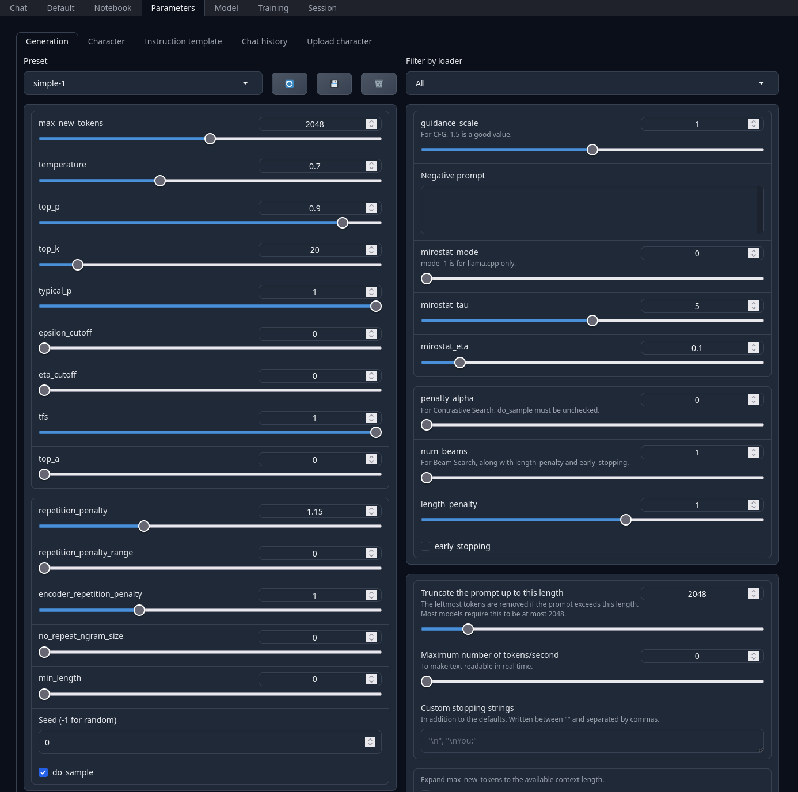
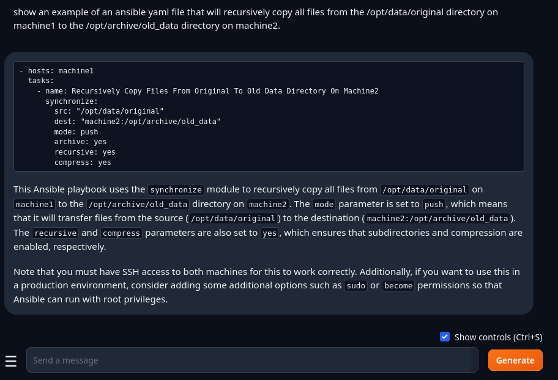
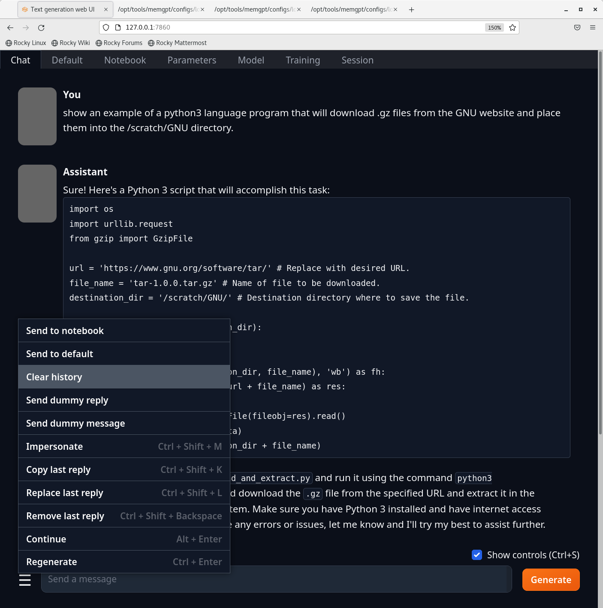
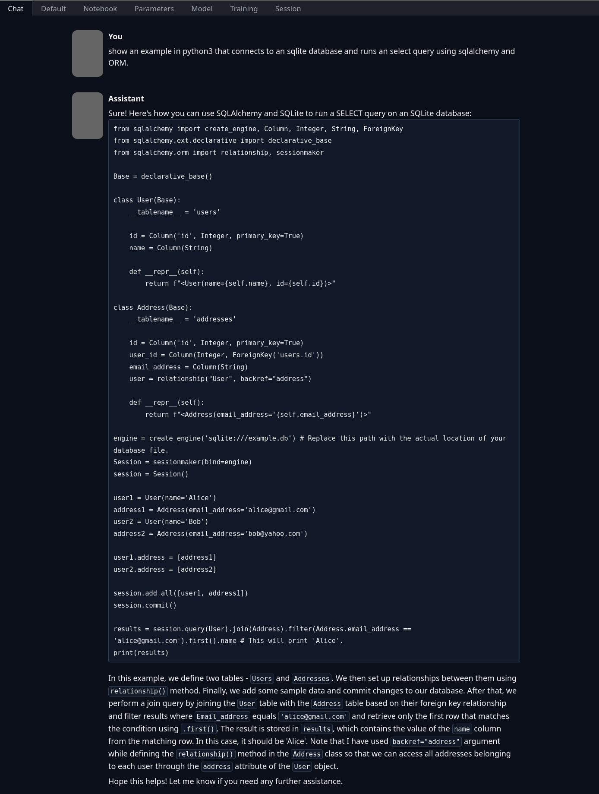
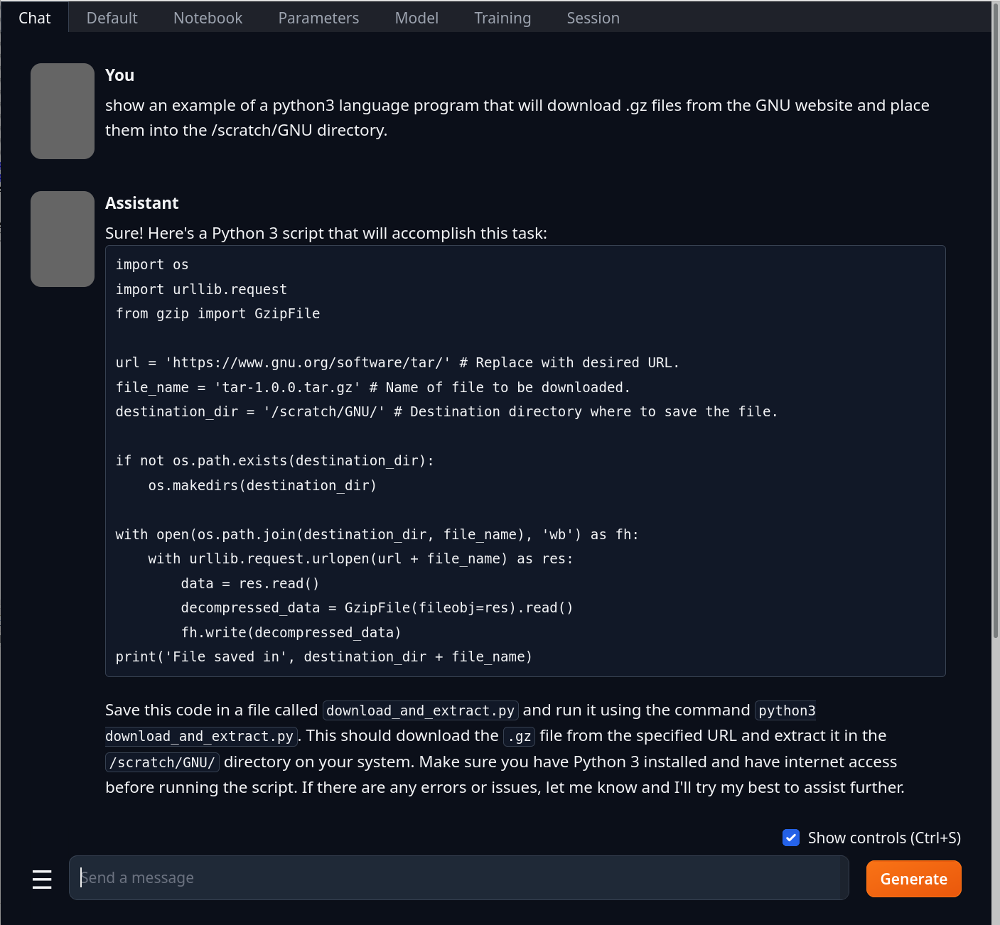
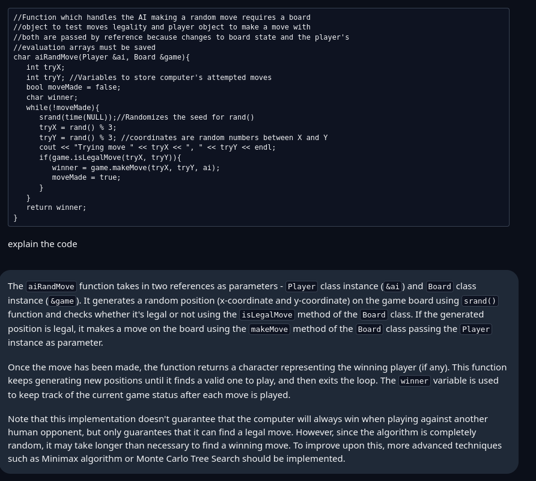
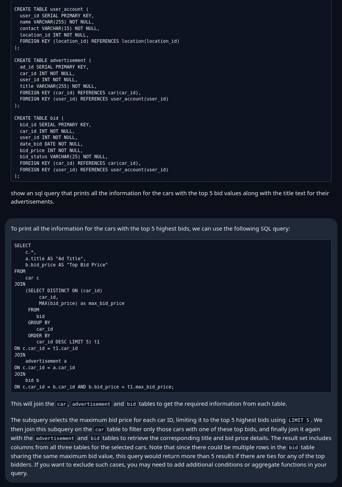

# Using Text-Generation-Webui with Llama2 Based AI Models
<table>
<tr>
<td>

</td>
</table>

## Table of Contents
- [What are LLaMa 2 and CodeLLaMa](#what-are-llama-2-and-codellama)
- [Installation](#installation)
- [Advice](#advice)
- [/opt on NFS](#opt-on-nfs)
- [NVidia Drivers](#nvidia-drivers)
- [Installation](#installation)
- [Launching Text-Generation-Webui](#launching-text-generation-webui)
- [Instruct Mode vs Chat mode](#instruct-mode-vs-chat-mode)
- [Clearing Context](#clearing-context)
- [Prompt Engineering](#prompt-engineering)
- [Explanations and Code Reviews](#explanations-and-code-reviews)
- [Preloaded Code](#preloaded-code)
- [References](#references)

## What are LLaMa2 and CodeLLaMa
**LLaMa2** is a Machine Learning (ML) Large Language Model (LLM) created by Meta (aka. Facebook) and released to the public in July 2023. The LLaMa2 license permits unlimited Public and Commercial use except for Meta's AI direct competitors (Google, LinkedIn...). This openness has sparked a massive eco-system of derivative models retrained for personal and practical use. In ML, the term retraining is analogous to providing a software patch with new functionality, new information or both.

All LLaMa2 derived models follow the same structure so they are interchangeable within the text-generation-webui software as long as your hardware has the required GPU resources. This installation procedure will download and install the **WizardLM** set of Code models derived from the CodeLLaMa text-to-code (English to Source Code) generator. If you look for the **WizardLM** model set on huggingface.com you will also notice other specialized models retrained for Math-Reasoning (aka solving SAT questions) and other impressive use cases.

The links below provide useful general information about the original LLaMa2 and CodeLLaMa models, however we will not be using these as they are considered **outdated** for daily use. They are only 4 months old but the ML development community moves so quickly that newer, more efficient models are available. It is worth a read to get familiar with terminology around ML models.  Yes, at the time of this writing these original models are only 4 months old but have been superseded by publicly created derivatives that are more accurate and more efficient when running on desktop GPU systems with limited Video RAM Memory.

```
See https://huggingface.co/meta-llama

See https://huggingface.co/codellama
```

The **WizardLM** series of models is just one of many retrained code-generation variants that exhibit a high accuracy across many interpreted (Python, Ruby, Go), compiled (C++, Java) and administrative (Linux/Bash, Ansible, ...) languages. These are highly reliable and quite efficient on GPU memory so they are used here.  However, to get the most out of your private GPU experience we will take it to the next level with GPTQ Quantization.

```
See https://huggingface.co/WizardLM

```

On huggingface.com there is an account called **TheBloke** that specializes in converting every model available in all sorts of formats {PyTorch format, safetensors format, TensorFlow format, etc...} into a single standardized format that is compatible with the **Hugging Face Transformers** Python module.  The **TheBloke** account also provides the larger models in 4-Bit Quantized formats.  I have been lead to believe, but cannot confirm, that **TheBloke** has the Data Center resources needed to run post-quantiation models against the input and output of the original model to correct as many edge case issues as possible. This is an extra step the most amateur model editors cannot do.

So when looking for a new or existing model to try out, I highly recommend looking in the **TheBloke** for a -GPTQ format model that has a number of Billions of Parameters that is close to (even slightly more than) the GB's of GPU memory you have.  Take it for a test drive and see what happens.

```
See https://huggingface.co/TheBloke/WizardCoder-Python-13B-V1.0-GPTQ
```

**Parameter Counts:** ML models released for public use list a Parameter Count which refers to the number of 16-Bit Floating Point values inside the Linear Algebraic core of the ML model. The (Parameter Count * Floating-Point Byte Size) can be used to estimate the minimum amount of GPU Memory needed to run the model.  Models below a few 10's of millions of parameters may run just fine on a CPU with no GPU.  100's of millions generally require a GPU and Billions of parameters absolutely require a GPU and possibly many GPU's for the mid-range (~70B) and high end (>120B) models.

**Quantization:** 16-Bit ML models can usually be converted to 8-Bit Floating Point models when loading into an application. 16->8-Bit quantization has a minimal effect on the accuracy of a model but does cut all GPU memory requirements by half. This works because the initial models are designed to be extended so they do not actually hold their theoretical maximum amount of information when released. In a pinch, shaving an equal number of decimal-places off of every floating-point parameter value results in no noticeable loss of data.

## Installation
This installation procedure (**recipe_llama2.sh**) will add and configure the bash, RPM, Python, Github and Huggingface assets required to run a private *Code*LLaMa 2 language model inside an OpenHPC Rocky 8.X root filesystem. Every software asset is version-locked to **September 12th 2023** code. This date marks the time when **text-generation-webui** reached a highly stable implementation for LLaMa 2 GPTQ quantized model support. Machine Learning libraries change their API's extremely quickly so slight deviations in module versions can render an entire application unusable. That is just how things in ML right now =D.

## Advice
Once you have a satisfactory root filesystem + application kit, administrators should **backup the entire root file system and /opt/ai_apps** directory as a unit. There is absolutely no guarantee that all of the Python module, ML model, NVidia driver and other back-dated dependencies will be available online in the near future.

```
warewulf:~$ ls -lad /var/lib/warewulf/chroots/*
drwxr-xr-x. 3 root root 4096 Dec  2 18:02 /var/lib/warewulf/chroots/rocky-8  <= NV Kernel and svcs, all Apps in NFS:/opt

```

## /opt on NFS
All python and github assets will be installed under **/opt/ai_apps/webui_llama2**.  The /opt directory is assumed to be accessed via NFS at runtime. These destinations can be changed via the NFSAPPS install variable or the apptainer --bind flag in the installation script. The NFS /opt directory must be writable so text-generation-webui can create chat log histories and character configuration entries. If the /opt directory is not writable then the **/opt/ai_apps/webui_llama2/text-generation-webui** must be copied locally to the compute server. Python can still run from the network.

## NVidia Drivers
Many of the Python modules contain checks against the exact version of the nvidia-driver installed. For this reason the nvidia-driver and CUDA 12.3 driver are both installed in the chroot filesystem rather than at runtime. This will leave a valid bootable linux kernel image inside the chroot's /boot directory as well as an initird image that contains the NVidia and CUDA drivers. The kernel image can be move into a warewulf dedicated kernel are using **wwctl kernel import** command.

Also note that the **/usr/local/cuda-12.3** installation tree and the **/opt/nvidia/nsight** will be moved to the warewulf master nost's /opt directory so they are not incorpoarted into the bootable root filesystem.

## Installation
Run the **recipe_llama2.sh** script as **root** on the warewulf master dispatch server and all installation and configuration steps will be completed automatically.
- The install assumes a fresh or stable Rocky 8.7 chroot image exists in **/var/lib/warewulf/chroots/rocky-8/rootfs**.
- Change the CHROOT variable in the installation script to relocate the install or change the chroot/<fs name> target.
- The install will use **apptainer exec** to mount (--bind) the warewulf master /opt to the chroot /opt in the same way a running NFS /opt mount would work.
- The Python applications and ML Models will be installed into **/opt/ai_apps/webui_llama2/models** and is partially configurable via the NFSAPPS variable.
- An official **Python 3.11.4** source .TGZ will be downloaded, compiled and **installed into /opt/ai_apps/webui_llama2** since the native Rocky python is too old.
- The chroots/.../usr/local/cuda-12.3 binaries will be moved to the warewulf master server's /opt/cuda/cuda-12.3 and removed from the rootfs.
- The chroots/.../opt/nvidia/nsight development tools will be moved to the warewulf master server's /opt/nvidia/nsight and removed from the rootfs.
- The installation will create a series of application scripts in /opt/ai_apps/webui_llama2 that will launch any requested models instantly.
- The installation will create a **run_server.sh** script that will allow the user to choose a model at launch time including new models added by hand.
- All user-facing assets will be *chown*-ed to the **test** user account at the end of the installation.
- The **wwctl container build rocky-8** command will run to recreate the bootable container with nvidia driver and updated kernel installed.

## Launching Text-Generation-Webui
Assuming the compute server has a single Tesla V100 with 16GB of GPU VideoRAM the user can choose from the set of scripts below. Each of these models is exactly the same and only differs by:
- How many (B=Billion) parameters for more accuracy and more information to serve to you

vs

- Quantization to smaller Floating-Point numbers freeing GPU Memory at the risk of losing some information on the edges

As a general rule, a model with more (Billions of) Parameters and a little Quantization (say 16-Bit -> 8->Bit) is far better than an unquantized model with fewer (Billions of) Parameters.
- /opt/ai_apps/webui_llama2/**run_wizard_13b_8bit_code.sh**   (13B *  8-Bit FP ~ 13GB min GPU Memory, quantized at load time, best option)
- /opt/ai_apps/webui_llama2/**run_wizard_7b_16bit_code.sh**   (7B  * 16-Bit FP ~ 14GB min GPU Memory, native un-quantized)
- /opt/ai_apps/webui_llama2/**run_wizard_13b_4bit_code.sh**   (13B *  4-Bit FP ~  9GB min GPU Memory, quantized and retrained in a data center, also useful)

Once Running the text-generation-webui will start listening for web browser requests on port **7860**. Connect using any web browser and let the fun begin.

- **Parameters Tab**:
- **max_new_tokens** = 2048     <= Input context, amount of text the current model can handle before internal reset (and forgetting your info). Your output will be randomly truncated if you do not set this correctly to match your model.
- **Seed**: = 0      <= Output has more consistency when repeating questions, seed = -1 makes LLM act more like a fickle person.

- **Chat Tab**:
- **chat**: Language model is in **"User"** mode where you can define a personality for the LLM and and your own preferences to make the LLM behave in a certain way.
- **instruct**: Language model is in **"Assistant"** mode like a strict personal Butler.  Answers are direct and to the point with no cleverness or attitude.
- **chat-instruct**: Language model in 1/2 way between like a Butler who knows you well enough to be clever and overly suggestive at times.

On the **Parameters Tab** change "**max_new_tokens to 2048**.  This setting is often referred to the Model's **Context Window** or **Input Context**.  In ML a Token is some fraction of a word. On average a Token represents 1/2 a word.  When a model supports **A 2048 Token Context Window** it roughly means it supports about 1000 words of combined input and output (via feedback as input) before the model starts forgetting what you are talking about. For code generation, if you follow the Prompt Engineering recommendations below and be very specific on the first request then it should never be a problem. If you start having back-and-forth dialog then the system will appear forgetful.

On the **Parameters Tab** change "**seed to 0**. A seed=-1 gives the model some "moodiness" that is OK in chats but annoying when creating software designs.  I have actually had an LLM **refuse to generate TCSH** in the middle of a heavy Bash scripting session.

<center>
<table cellspacing="0" cellpadding="0" style="width: 1000px; border-collapse: collapse; border: none;">
<tr style="border: none;">
<td style="width: 35%; border: none;">

</td>
</tr>
</table>
</center>

## Instruct Mode vs Chat Mode
On the main **Chat Tab** in the **Show Controls** section near the bottom of the page there is the pure **Chat**, **Chat-Instruct**, **Instruct** Mode radio buttons. Instruct is often the most productive no nonsense mode. If you know the language and architecture of the software being created then this is the fastest way to work.

<center>
<table cellspacing="0" cellpadding="0" style="width: 1000px; border-collapse: collapse; border: none;">
<tr style="border: none;">
<td style="width: 35%; border: none;">

</td>
</tr>
</table>
</center>

If you are new to a language and want to use an LLM as a teaching device then Chat mode(s) are a better option.

## Clearing Context
Language models, like HTTP requests, are state-less. Applications that use LLMs give the appearance of an ongoing dialog back-and-forth by continually sending the entire bi-directional conversation (user requests and computer responses) back into the LLM as input before the next request. Longer conversations can overrun the Context Window which just means the LLM will start forgetting what it has recently said.  For the case where the user wants to transition to a new topic, it's best to clear the history buffer and start a fresh stateless request or conversation.

- Click the **3-lines menu** to the left of the "Send a message" text box.
- Click **Clear History** near the top of the pop-up menu.
- Click **Confirm** to empty the history

<center>
<table cellspacing="0" cellpadding="0" style="width: 1000px; border-collapse: collapse; border: none;">
<tr style="border: none;">
<td style="width: 35%; border: none;">

</td>
</tr>
</table>
</center>

## Prompt Engineering
Prompt Engineering is an attempt to improve an LLM's accuracy when terse or context-specific requests are given. Smaller models do not do as well with terse or ambiguous requests. That goes double for code generation and code review models that need precision to create your desired output. When using a code model for software or script production I recommend the following general text pattern:

```
{Show, Give, Create, Print} an example of a {python3, java17, linux bash, Ansible YAML} language {program, class named CCC, function named do_FFF}
 that does X using the Y {library, module, function, command} with Z on {machine, /dir/path, algorithm} M.
```

- **"an example"**: Language models want to find a single response from millions of internal statements. They will often ask 2-5 follow-up questions to the point where it can get annoying and possibly exceed the Context Window. By expressing "an example" the model will simply choose an option and move forward without asking any questions unless the ambiguity is extreme.
- **"python3"**: Be very specific with the language and version or output format when possible. Models will happily present Python2 (obsolete 2017), Java 4 (Ancient) or Ansible JSON (with inline JSON chunks) if it technically satisfies your request under **"an example"** openness.
- **"program"**: If you want a python script with all the **import** and other supporting code then ask for **A Program**'s worth of output.  If you just ask for Python3 code then you will likely get an un-runnable function surrounded by paragraphs of explanation. If you are adding code to an existing software app then this Text-Book style output may be perfect. If you are starting a new program or learning a programming language then you need to coax the LLM into verbose code output by asking for more than you need (A file with..., A program containing,, a class that uses module X to...)
- **"Y library"**: There are often a dozen or more ways to solve a single programming problem in one language. Use lots of native code with no library dependencies, use specialized modules that have installation requirements, use simple libs, complex/advanced libs, software-architect your own modular libs.  To humans these all represent differing level of difficulty but to the LLM it's all identically simple
- **"Y library"**: There are many ways to solve any programming problem in a given language. Use lots of native code with no library dependencies, use specialized modules that have installation requirements, use simple libs, complex/advanced libs, software-architect your own unique libs. To humans these all represent levels of difficulty but to the LLM it's all identically simple boring text output. Call out all critical ingredients so the LLM can choose wisely for you.
- **"machine M"**: LLM's are not perceptive so there is a huge difference in accuracy between "send PDF files to bigbox" and "recursively copy all '*.pdf' files from my linux /opt/data directory to machine bigbox in the /opt/archive/data directory". It's ok to over-qualify the structure of proper nouns and concepts.
- **"Think LEGOs"**: If you apply too many conditions in one request then the LLM will drop requirements because it can only report what it has seen in the past.  If you break up your requests into virtual software blocks and test as each block is merged, then your productivity will be amazing.  **"show an example of a python3 wxPython GUI main loop."**,  **"show an example of a wxPython GUI File and About menu"**,  (merge samples), **"show an example of a wxPython drawing canvas with scroll bars"** (merge samples), textboxes, dialogs, File Save action, GridLayout example, ...   You'll have a working GUI in a couple of hours with no bugs.

<center>
<table cellspacing="0" cellpadding="0" style="width: 1000px; border-collapse: collapse; border: none;">
<tr style="border: none;">
<td style="width: 35%; border: none;">

</td>
</tr>
</table>
</center>

<center>
<table cellspacing="0" cellpadding="0" style="width: 1000px; border-collapse: collapse; border: none;">
<tr style="border: none;">
<td style="width: 35%; border: none;">

</td>
</tr>
</table>
</center>

## Explanations and Code Reviews
Code Language models are also relatively good at explaining and reviewing arbitrary segments of code supplied.

- **Shift + Enter**:  Adds a normal carriage return in the "Send a Message" text box.
- **```**:  Triple Back-Tick marks the beginning of a Code Block or other highlighted segment of text
- **Paste**: Paste the minimum amount of code that you need explained or reviewed. Remember you have a limited context window.
- **```**:  Triple Back-Tick marks the end of a Code Block or other highlighted segment of text
- **Shift + Enter**:  Adds some white space between your code and your request
- **Explain this code**

<center>
<table cellspacing="0" cellpadding="0" style="width: 1000px; border-collapse: collapse; border: none;">
<tr style="border: none;">
<td style="width: 35%; border: none;">

</td>
</tr>
</table>
</center>

## Preloaded Code
Using the simple SQL schema found in **https://medium.com/@syaifulhuseinnn/selling-used-car-relational-database-sql-project-7648d9e99cee** we can use the LLM to parse a schema and generate precise SQL on demand. The SQL schema is reprinted in the References section of this document.  Also note that you do not have to add the entire schema. The LLM only needs the relevant tables and when only those fields in the tables that are part of the SELECT, JOIN or WHERE clauses if your tables are rather large.  You must always be aware of the **Context Window Size**.

- **```**:  Triple back-tick to open the start of a code block.
- **paste in the relevant bits of schema**
- **Shift + Enter**: to add a blank line or two at the end of the code block
- **```**:  Triple back-tick to close the code block.
- **Shift + Enter**: Add some white space before your request
- **the request**: show an sql query that prints all the information for the cars with the top 5 bid values along with the title text for their advertisements.
- **Generate**

Note that the English request makes direct reference to table and field names when possible reducing ambiguity. If a table or field is named SalesStaff then use that name and not "people who sold cars..." or some other indirect mentions.

<center>
<table cellspacing="0" cellpadding="0" style="width: 1000px; border-collapse: collapse; border: none;">
<tr style="border: none;">
<td style="width: 35%; border: none;">

</td>
</tr>
</table>
</center>

## References

SQL Schema

```
CREATE TABLE location (
  location_id SERIAL PRIMARY KEY,
  city_name VARCHAR(50) NOT NULL,
  latitude FLOAT NOT NULL,
  longitude FLOAT NOT NULL
);

CREATE TABLE car (
  car_id SERIAL PRIMARY KEY,
  brand VARCHAR(100) NOT NULL,
  model VARCHAR(255) NOT NULL,
  body_type VARCHAR(25) NOT NULL,
  car_type VARCHAR(25) NOT NULL,
  year INT NOT NULL,
  price INT NOT NULL
);

CREATE TABLE user_account (
  user_id SERIAL PRIMARY KEY,
  name VARCHAR(255) NOT NULL,
  contact VARCHAR(15) NOT NULL,
  location_id INT NOT NULL,
  FOREIGN KEY (location_id) REFERENCES location(location_id)
);

CREATE TABLE advertisement (
  ad_id SERIAL PRIMARY KEY,
  car_id INT NOT NULL,
  user_id INT NOT NULL,
  title VARCHAR(255) NOT NULL,
  FOREIGN KEY (car_id) REFERENCES car(car_id),
  FOREIGN KEY (user_id) REFERENCES user_account(user_id)
);

CREATE TABLE bid (
  bid_id SERIAL PRIMARY KEY,
  car_id INT NOT NULL,
  user_id INT NOT NULL,
  date_bid DATE NOT NULL,
  bid_price INT NOT NULL,
  bid_status VARCHAR(25) NOT NULL,
  FOREIGN KEY (car_id) REFERENCES car(car_id),
  FOREIGN KEY (user_id) REFERENCES user_account(user_id)
);

```

